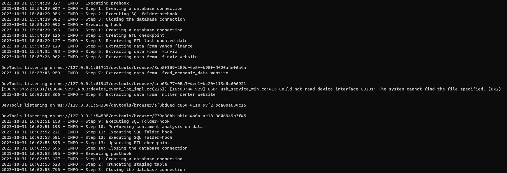
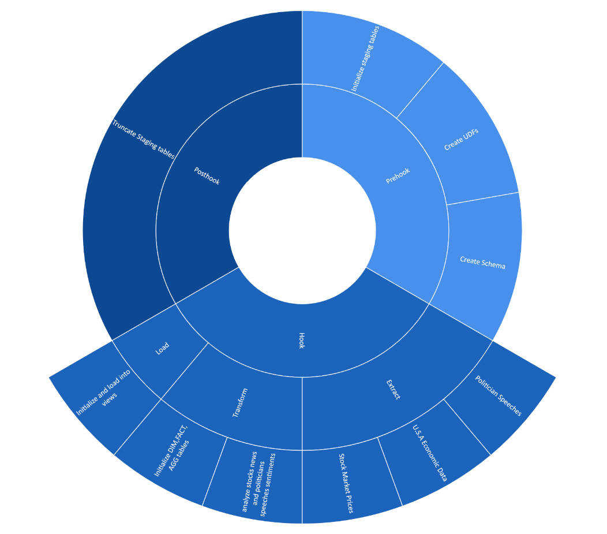

<div>

> Hello world! This is the project’s summary that describes the project, plain and simple, limited to the space available.
**[PROJECT PHILOSOPHY](#project-philosophy) • [PROTOTYPING](#prototyping) • [TECH STACKS](#stacks) • [IMPLEMENTATION](#demo) • [HOW TO RUN?](#run)**

</div> 
  

<br><br>

<!-- project philosophy -->

<a  name="philosophy" ></a>


> A python based ETL project that would extract, transform data from different web sources and load them into a tabular database (PostgreSQL) in an attempt to provide a full scope analytical understanding of the USA recession. 


  

### User Types

1. Data Engineers.
2. Data Analysts.
3. Economists.
4. Policy Makers.
5. Journalist.
  
<br>

### User Stories

  
1. As a Data Engineer:  
	I want to automatically scrape various economic indicators from reputable sources so that our dataset is always up-to-date.
	I want to integrate different data sources seamlessly.
	Ensure fault tolerance in our data pipelines, so that potential failures don't interrupt our analyses.
2. As an Analyst:  
	I want to query the database.
	I want to view the sentiment analysis results to understand public sentiment around economic conditions.
	I want to visualize the data using PowerBI.
3. As an Economist:  
	I want to access a dataset that provides a holistic view of the US economic landscape post-COVID-19.
4. As a Policy Maker:  
	I want to understand if the US is still in recession to make informed decisions about economic policies.
	I want to view reports highlighting key economic indicators and their trend over time.
5. As a Journalist:  
	I want to access clear visualizations.
	I want to understand public sentiments.
	I want an access on the historical view of the economic indicators to showcase trends.


<br><br>

<!-- Prototyping -->
<a name="prototyping"></a>


> We have designed our projects to webscrape, through an ETL project and including it in a PowerBI Sample Dashboard, 


### Logger File

| CLI logs |
|---|
||


### Data Flow Diagrams

| ETL-Hook Cycle |
|---|
||

### Extract Phase

#### Webscrape USA economic data

-	Leverage Selenium to automatically set the date into the ETL date, enabling the retrieval of all data from that specified date onward.
-	Retrieve the downloadable csv link and ingest its contents into the database  


| Webscrape USA economic data demo |
| --------------------|
||

#### Webscrape USA politician speeches


-	Part 1: Utilize Selenium to automatically access the main politician speeches page and scroll down until reaching the ETL date. 
-	Part 2: Access the headlines one by one and webscrape the transcript text of the speeches.


| Webscrape USA politician speeches (part1) | Webscrape USA politician speeches (part2) |
| ---| ---|
|  | | 


### Dashboard

https://github.com/FawziElZein/usa_recession_analysis/assets/56543752/6d9124e2-3b75-4745-a990-db0f9193264d


<!-- Tech Stacks -->

<a  name="Stacks"  ></a>


> Show command line of ETL performance - Logger view

  

Bin Tracker is built using the following technologies:


## Frontend

Interactive Power BI Dashboard:
A central dashboard where viewers can check:

1. Economic Indicators: Graphs, charts and visualizations displaying key economic metrics over time.
2. Sentiment Analysis: Representations of public sentiment about economic conditions through pie charts, and sentiment bars.
3. Predictive Analysis: A visualization of the ML model's performance about the US economic recovery compared to actual data.
4. Interactive filters: options to filter data by date, region, or specific economic indicatiors for customized views.


## Backend

1. Web scraping & Automation.
2. ETL Pipeline: using Python and pandas, raw data is extracted, transformed into a usable format and loaded into PostgreSQL database.
3. Database: Schema Design - Indexing - Data Integrity - Backup & Recovery.
4. Sentiment Analysis: "Using OpenAI's Large Language Model. 


<br><br>


<!-- Implementation -->

<a  name="implementation"></a>


<br>

### Power Bi Dashboard


| Landing Page |
| ---|
| |

| National Overview |
| ---|
| |

| State Wise Overview |
| ---|
| |

| FAANG Overview |
| ---|
| |

<br><br>


<!-- How to run -->

<a  name="run"  ></a>

  

> To set up **USA Recession Analysis and Prediction** follow these steps:

### Prerequisites


**Hardware & Software**:

-   A computer/server with sufficient RAM and processing power.
-   Operating system: Linux (preferred for production) or Windows.
-   Required software: Python (3.x), PostgreSQL, Git (for version control)
  
**Dependencies**:

-   Install the necessary Python libraries: `psycopg2-binary`, `pandas`, `selenium`, `requests`, `yahoofinancials`,`langchain`,`tqdm`,`python-dotenv`
-   Install database connectors/drivers for PostgreSQL.
  

### **Setting Up the Environment**:

**Clone the Repository**:


```sh

git clone https://github.com/FawziElZein/usa_recession_analysis

```

  
**Set Up the Database**:

-   Start the PostgreSQL server.
-   Create a new database and user with the appropriate permissions.

**Set Up Environment Variables**:
-	Create a new file in the project directory titled .env, which will include all the environment variables related to the ETL: DATABASE_NAME, HOST, PORT_NUMBER, USER, PASSWORD, and OPENAI_API_KEY. The example below illustrates the file format.  

	- DATABASE_NAME = "*usa_recession_db*"  
	- HOST= "*localhost*"  
	- PORT_NUMBER= *5432*  
	- USER=  "*postgres*"  
	- PASSWORD= "*your_password*"  
	- OPENAI_API_KEY= "*your_open_ai_api_key*"

### **Running the Backend**:

**Start the Data Ingestion & ETL Process**:
`python main.py`


You should be able to check the app.log file to see the ETL work.

As for the dashboard access: Please use this link "https://app.powerbi.com/view?r=eyJrIjoiNmI2ZDMzZDEtYjI3Ny00M2Y3LTg2NGItNmJmOTE2MWYzZWI2IiwidCI6IjJhZDk2OTM0LTQzZTUtNDFjMi05NzYxLWYzMzVmZTIxNGNjMyIsImMiOjl9" to access your data.
